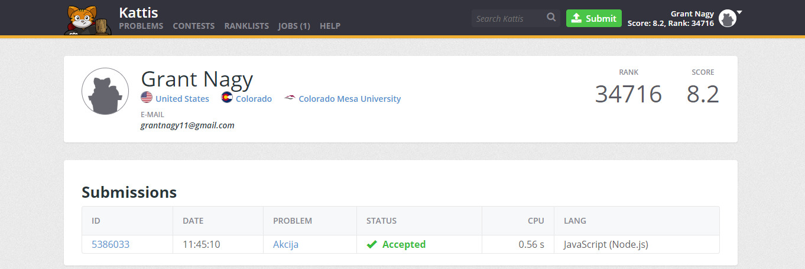

# Kattis Problems

| Problens        | Difficulty           | Grade  |
| ------------- |:-------------:| -----:|
| Akcija    | 2.0 | 100% |
| A Different Problem  | 2.3 |   100% |
| Above Average | 2.2  |    100% |

Final Grade 100%

## Akcija
### Difficulty: 2.0
https://open.kattis.com/problems/akcija

[Different Problem: Source Code](https://github.com/grantnagy/AdvJS-gnagy/blob/master/kattis/Akcija/Akcija.js)

***

## A Different Problem
### Difficulty: 2.3
https://open.kattis.com/problems/different

[Different Problem: Source Code](https://github.com/grantnagy/AdvJS-gnagy/blob/master/kattis/Different/different.js)

***

## Above Average
### Difficulty: 2.2
https://open.kattis.com/problems/aboveaverage

[Different Problem: Source Code](https://github.com/grantnagy/AdvJS-gnagy/blob/master/kattis/above%20average/aa.js)

***
